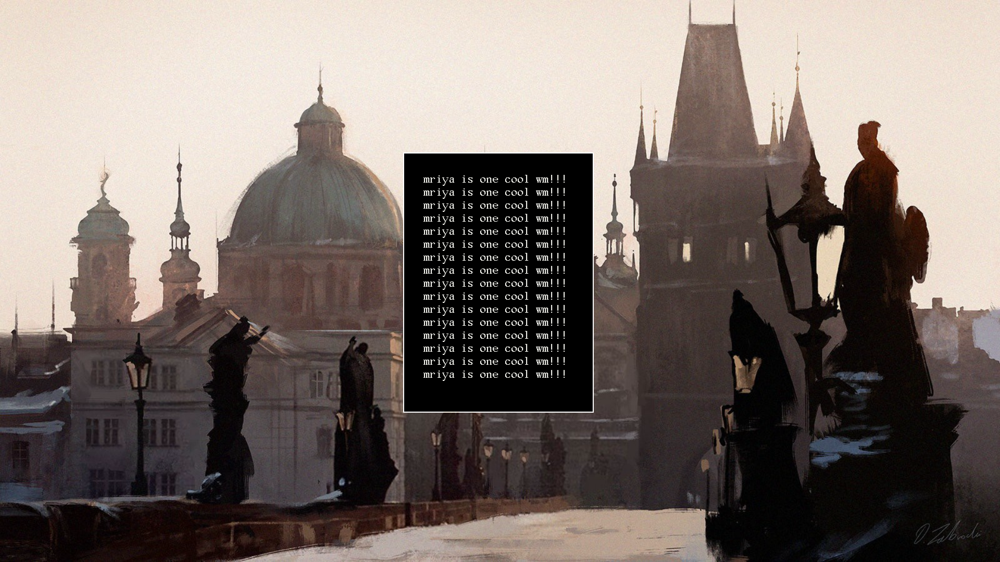

# mriya
a scrolling x11 window manager.

<p align="center">
  
</p>

- if u make a cool rice and create a pull request with (like replacing the current image) it ill prob merge it

# what is it?

mriya is a scrolling x11 window-manager inspired by niri, i3wm and plan9's rio. 

# why use this?

- simple codebase
- you can actually reliably take screenshots, unlike wayland compositors.
- its actually smaller than dwm!?

# fun fact

- mriya was named after the an225 mriya, the largest aircraft ever that was destroyed during the russo-ukranian war.

- mriya means dream in ukranian.

# compile

```bash
git clone https://github.com/hokum-b/mriya
cd mriya/
chmod +x install.sh
./install.sh
```

# deps

- libX11-devel
- libxkbfile-devel
- libxkbcommon-devel
- alsamixer
- brightnessctl


# keybinds

- mod + return/enter = open TERM
- mod + shift + return/enter = open TERM
- mod + d = open DMENU
- mod + shift + q = close focused window
- mod + shift + e = kill wm
- mod + shift + r = restart wm
- mod + h / left = focus left
- mod + l / right = focus right
- mod + j = decrease inner gap
- mod + k = increase inner gap
- mod + shift + j = reset gaps
- mod + space = zoom (swap with master)
- mod + shift + space = toggle floating
- mod + f = toggle maximize
- mod + shift + f = toggle fullscreen
- mod + tab = switch to last workspace
- mod + up = workspace up
- mod + down = workspace down
- mod + 1-9 = switch to workspace 1-9
- mod + shift + 1-9 = move window to workspace 1-9
- mod + ctrl + 1-9 = toggle workspace 1-9 visibility
- mod + ctrl + shift + 1-9 = toggle workspace 1-9 on window
- mod + lmb (drag) = move window 
- mod + rmb (drag) = resize window 

# applications

edit `config.h`:

```c
#define TERM "st"
#define DMENU "dmenu_run"
#define BROWSER "firefox"
#define FILEMANAGER "pcmanfm"
```

# license

mriya is licensed under the [ISC license](LICENSE)
